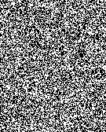
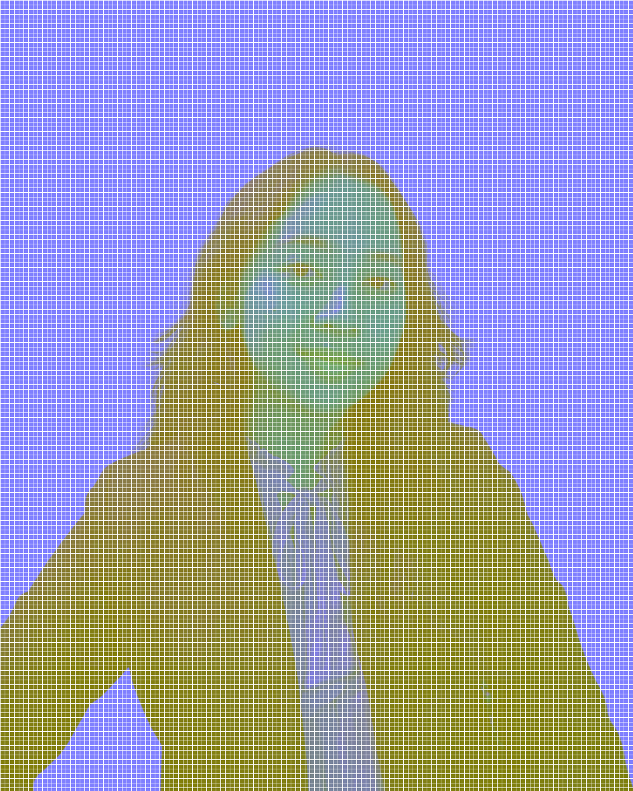
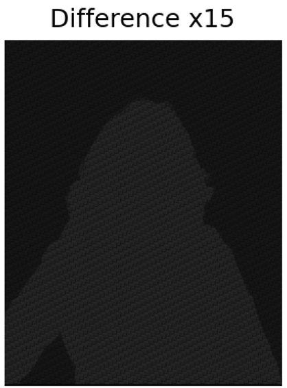
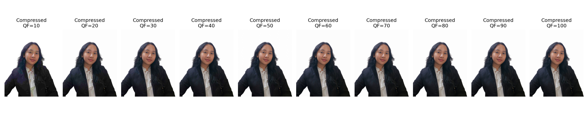
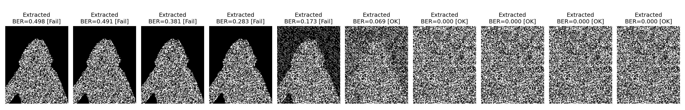
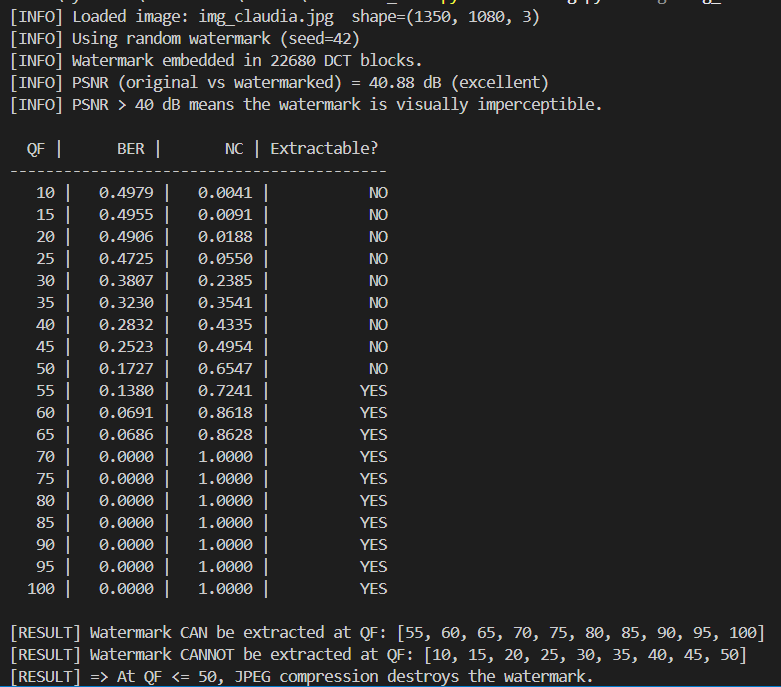
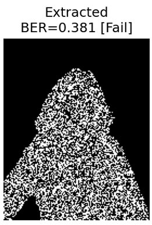
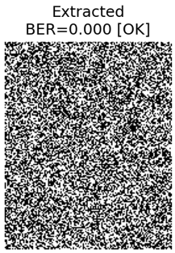
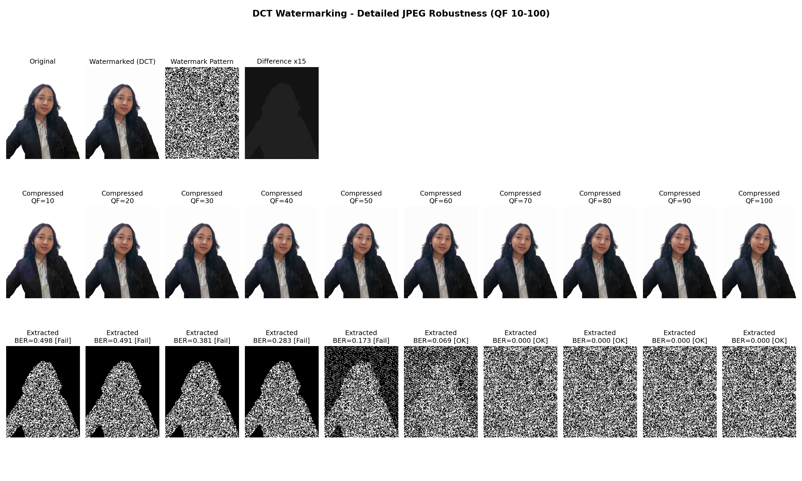
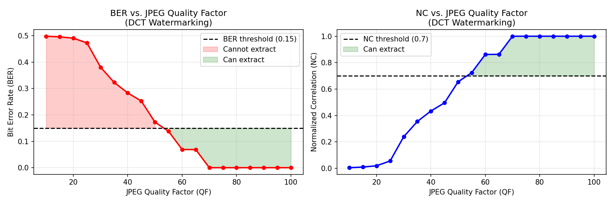

# Penjelasan Kode Watermarking DCT
**Untuk penjelasan yang lebih lengkap, termasuk penjelasan kodenya terdapat pada file PDF atau DOCS berjudul "Penjelasan_18224032_Claudia Melati Krid"**
**Claudia Melati Krid - 18224032**

## Teknik Watermarking
Teknik watermark yang dipakai adalah **DCT (Discrete Cosine Transform)** dengan cara:
1. Membagi gambar menjadi blok berukuran 8*8 pixel.
2. Setiap blok akan diubah ke domain frekuensi menggunakan rumus DCT.
3. Watermark disisipkan ke koefisien frekuensi menengah. Koefisien frekuensi menengah dipilih karena cukup invisible namun masih tahan kompresi.
4. Untuk tugas kali ini, saya menggunakan watermark berupa citra acak (**random PN sequence**)
5. Setelah disisipkan watermark, gambar didekompresi kembali ke domain spasial menggunakan **Inverse DCT**

---

## Penjelasan Prosedur

### 1. Import
Pada bagian ini, dijalankan import untuk menambahkan library seperti:
- **Argaparse**: membaca argument terminal
- **io**: buffer memory
- **os**: operasi file / folder
- **cv2**: untuk memproses gambar dan DCT
- **matplotlib**: untuk memplotting grafik outputnya nanti
- **numpy**: untuk men-generate matrix
- **PIL**: untuk menyimpan JPEG dengan Quality Factor (QF) tertentu sebagai output

### 2. Watermark Generation
Pada random watermark generation, watermark akan dibuat secara pseudo-random yang dapat dilihat pada bagian `rng = np.random.default_rng(seed)`. Ukuran watermark yang dihasilkan disesuaikan dengan ukuran gambar melalui kalkulasi pada `wm_size = (H // 8, W // 8)`, satu bit per blok DCT 8*8. Watermark citra acak untuk foto yang saya gunakan (img_claudia.jpg) yang sudah di-generate dan akan disisipkan nantinya dapat dilihat pada gambar berikut:

*Watermark yang di-generate dan akan digunakan*

### 3. DCT Embedding
Kemudian, bagian ini adalah untuk menentukan posisi frekuensi gambar yang akan diberi watermark yaitu pada area frekuensi menengah karena koefisien frekuensi menengah dipilih karena cukup invisible namun masih tahan kompresi.

Gambar kemudian diubah menjadi **YCrCb** karena watermark akan disisipkan pada channel **Y (luminance)** karena brightness (Y) lebih sensitif dan JPEG bekerja dominan di Y sehingga watermark akan lebih signifikan.

| Gambar Asli | Gambar yang Diubah menjadi YCrCb |
|:---:|:---:|
|  |  |

Setelah dipisah menjadi YCrCb, akan diloop per blok 8*8 untuk discan kemudian akan ditransformasi ke domain frekuensi (`dct_block = cv2.dct(block)`).

*Gambar YCrCb yang Dibagi ke dalam Blok 8*8 Pixel*

Lalu, koefisien DCT akan dimodifikasi dengan menambahhkan alpha. Terakhir, pada baris `cv2.idct(dct_block)`, domain frekuensi dikembalikan ke domain gambar dan akan menghasilkan output berupa gambar yang sudah diberi watermark.

*Gambar yang Sudah Diberi Watermark*

Berikut gambaran perbedaan pixel antara gambar yang sudah diberi watermark dengan gambar original:

*Difference map → pada gambar ini, selisih diperkuat x15 supaya selisih piksel terlihat lebih jelas. Untuk yang berwarna putih (lebih terang) berarti perbedaan piksel pada area tersebut lebih besar. Sedangkan untuk yang berwarna hitam, artinya perubahan kecil.*

### 4. JPEG Compression
Fungsi `jpeg_compress` berperan untuk mengkompres JPEG dengan Quality Factor (QF) tertentu, yaitu pada QF=10 hingga QF=100 dengan interval 5. Jika QF kecil, maka kompresi menguat dan kualitas akan menurun. Sedangkan jika QF besar, maka kompresi akan ringan dan kualitas output akan lebih bagus. Berikut perbandingan hasil kompresi gambar di berbagai QF.

### 5. Ekstraksi Watermark
Pada bagian ini, watermark diekstrak dengan membandingkan koefisien DCT gambar terkompresi terhadap gambar asli sebagai referensi. Berikut hasil ekstraksi watermark untuk rentang QF 10 hingga 100 (interval 10), dan dapat dilihat bahwa pada QF yang rendah (berarti kompresi menguat), watermark tidak dapat diekstraksi secara sempurna.

---

## Evaluasi Kinerja Watermark
Saya mengubah Quality Factor (QF) menjadi beberapa nilai dari rentang QF=10 hingga QF=100 dengan interval 5 dan menghasilkan output berikut.

Dapat dilihat bahwa watermark dapat diekstrak mulai dari **QF 55 hingga 100**. Sedangkan untuk **QF<= 50** tidak dapat diekstrak. Outputnya, untuk QF >= 55, watermark akan terlihat halus sedangkan jika QF <= 50, gambar akan terlihat buram. Contohnya dapat dilihat pada gambar di bawah ini (gambar saya zoom supaya perbedaan terlihat lebih jelas):

| QF 30 (tidak extractable) | QF 70 (extractable) |
|:---:|:---:|
|     |     |

### Visual Summary
Rangkuman perbandingan kompresi foto dan ekstrasi watermark di berbagai QF:

Pada perbandingan hasil ekstraksi watermark pada berbagai level QF, dapat terlihat bahwa pada QF <= 50 (misalnya pada QF=10 dan QF=30 yang memiliki label destroyed), hasil ekstraksi watermark membentuk siluet dari foto yang diimport. Hal ini disebabkan karena foto memiliki latar belakang putih polos yang mengandung frekuensi rendah. Saat kompresi agresif (QF rendah), koefisiennya di-quantize menjadi 0 dan watermark pada area latar belakang hilang sepenuhnya sehingga menyisakan siluet subjek foto.

Di sisi lain, pada QF >=55 (misalnya pada QF = 70 dan QF = 95 yang memiliki label extractable), watermark dapat diekstraksi sepenuhnya karena di QF yang tinggi, nilai table kuantisasinya kecil sehingga hampir tidak ada koefisien yang dibuang.

### Grafik Quality Factor
Pada grafik kiri (BER), Bit Error Rate tinggi di QF yang rendah and turun drastis setelah QF >= 55 (sesuai dengan evaluasi kinerja watermark dan visual summary sebelumnya). Sedangkan pada grafik yang kanan (NC), Normalized Correlation naik signifikan setelah QF >= 55 yang berarti kesamaan antara watermark asli dengan yang diekstrak berhasil diverifikasi ketika QF lebih dari 55.

